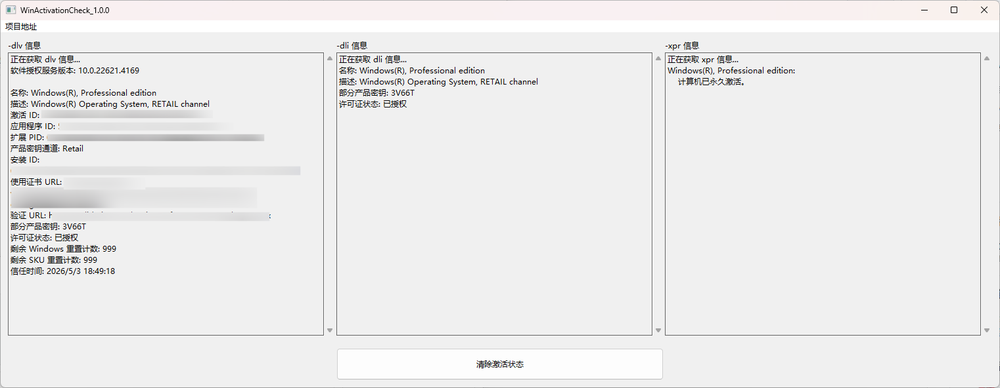

# WinActivationCheck

基于 Rust 构建的轻量级 Windows 激活状态可视化检查工具。调用 Windows 原生的 `slmgr.vbs` 脚本命令，更直观便捷地查看和管理操作系统的激活授权状态。

## ⬇️ 下载使用

前往 [Releases](https://github.com/NeetheCheeBao/WinActivationCheck/releases)页面下载

## ⚖️ 许可证

本项目采用 MIT 许可证 - 详情请参阅 [LICENSE](LICENSE) 文件。
